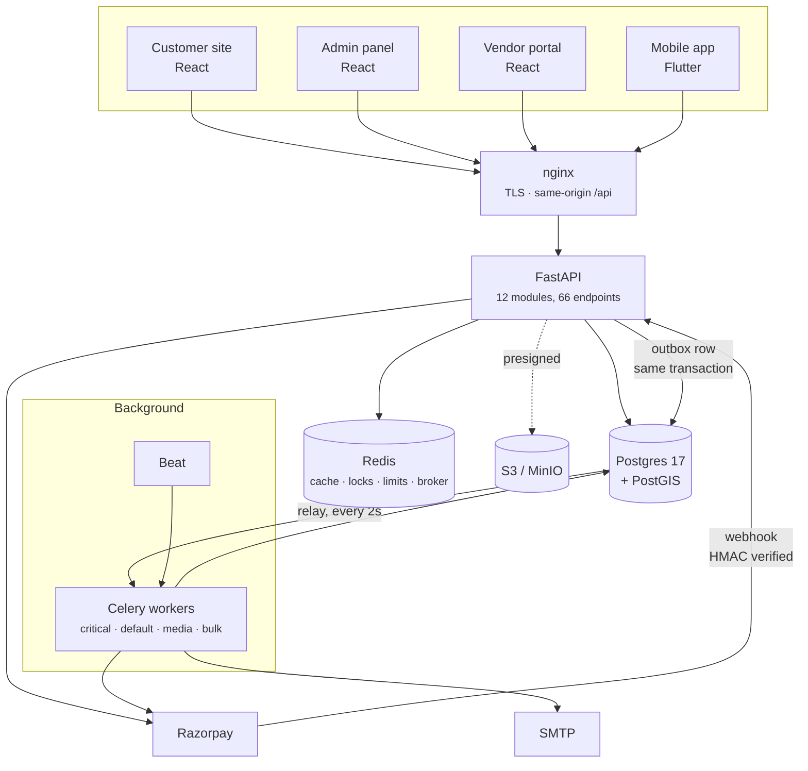

# Roaming &amp; Wandering

A two-sided travel booking platform for the Indian market — guests book stays,
hosts list and price them, staff moderate the whole thing. One backend, three
web clients, one mobile app.

It is a portfolio project, built to production standards rather than to demo
standards: the interesting parts are the ones that only matter when something
goes wrong. Double-booking under concurrency, refunds that must not run twice,
a deploy that happens mid-checkout, an offline phone at a reception desk.

```
84,000 lines · 12 backend modules · 66 HTTP endpoints · 1,522 tests
```

| | | |
|---|---|---|
| **Backend** | FastAPI · Python 3.13 · Postgres 17 + PostGIS · Redis · Celery | 46k lines |
| **Customer site** | React 19 · TypeScript · Vite · TanStack Query | 9.5k lines |
| **Admin panel** | React 19 · TypeScript | 3.6k lines |
| **Vendor portal** | React 19 · TypeScript | 4.1k lines |
| **Mobile app** | Flutter · Riverpod · Dio · Hive | 20k lines |
| **Deployment** | Docker Compose · nginx · Prometheus · Grafana · Loki | — |

---

## Run it

Docker, and five terminals.

```bash
git clone <this repo> && cd roaming-wandering

cd backend && make setup && make up && make seed
```

`make setup` generates JWT keys and a `.env`; `make up` starts Postgres, Redis,
MinIO, Mailpit, the API and the workers; `make seed` creates three accounts and
a demo listing so there is something to look at.

```bash
cd frontend && npm ci && npm run dev    # customer site  → :5173
cd admin    && npm ci && npm run dev    # admin panel    → :5174
cd vendor   && npm ci && npm run dev    # vendor portal  → :5175
cd mobile   && flutter run              # iOS / Android / Chrome
```

### Sign in

One password for all three seeded accounts: **`DevPassword123!local`**

| Where | Who | What you can do |
|---|---|---|
| [:5173](http://localhost:5173) | `guest@roamingwandering.local` | Search, book, pay, review, save to a wishlist |
| [:5174](http://localhost:5174) | `admin@roamingwandering.local` | Moderate listings, users, bookings, payments |
| [:5175](http://localhost:5175) | `host@roamingwandering.local` | Manage a property, its calendar and its pricing |

Also running: the API at [:8000/docs](http://localhost:8000/docs), MinIO at
[:9001](http://localhost:9001) (`minioadmin`/`minioadmin`), and **Mailpit at
[:8025](http://localhost:8025)** — every email the platform sends lands there,
so the signup and password-reset flows work end to end without a mail server.

---

## How it fits together



The one arrow worth following is `API → outbox row → relay → worker`. Nothing
publishes an event directly: the event is committed to Postgres in the same
transaction as the state change it describes, and a relay drains it afterwards.
That is what makes "cancel a booking and refund it" atomic in the only sense
that matters — see [ADR 0005](docs/adr/0005-transactional-outbox.md).

### Backend module map

Twelve modules, each owning `domain / application / infrastructure / interface`,
each reachable from another only through its published `public/` contract.
**Thirty-one `import-linter` contracts enforce that**, and CI fails when one is
broken — a modular monolith without enforcement is just a monolith with good
intentions.

```
auth        Sessions, RBAC, rotating refresh tokens, OTP, Google sign-in
property    Listings, rooms, inventory, PostGIS search, pricing rules
booking     Holds, the state machine, cancellation policy, refund decisions
payment     Razorpay orders, webhooks, refunds, reconciliation, ledger
vendor      Host onboarding, KYC, earnings, payouts
admin       Moderation, analytics, the staff surface
review      Ratings, moderation, host replies
coupon      Discounts and their redemption rules
support     Tickets and messages
wishlist    Saved properties, merged from localStorage on sign-in
notification  Email delivery, templates, the send log
ai          Itineraries and review sentiment — degrades to off, never fails
```

---

## The decisions worth reading

Six things were contested enough to write down. Each says what it costs as well
as what it buys, and **what would have to change to make a different answer
right** — [full index](docs/adr/).

| | |
|---|---|
| [Modular monolith](docs/adr/0001-modular-monolith.md) | Booking is one transaction. Across services it is a saga, and the failure mode is a room sold twice. |
| [Money as integer minor units](docs/adr/0002-money-as-integer-minor-units.md) | ₹4,500.00 is `450000`, everywhere, in four languages. `Decimal` does not survive JSON. |
| [UUIDv7 keys](docs/adr/0003-uuidv7-primary-keys.md) | Application-generated ids with the index locality of a sequence. |
| [Half-open date ranges](docs/adr/0004-half-open-date-ranges.md) | `[in, out)`, enforced by a Postgres exclusion constraint. Double-booking is impossible at the storage layer. |
| [Transactional outbox](docs/adr/0005-transactional-outbox.md) | Redis is the transport; Postgres is the record. Consumers must be idempotent. |
| [Rotating refresh tokens](docs/adr/0006-refresh-token-rotation.md) | Reuse revokes the family — which is why all four clients implement single-flight refresh. |

The narrower reasoning lives next to the code it constrains. The module and
file docstrings are written to be read: `middleware/rate_limit.py` explains the
per-route policy, `CatalogRepository` in the Flutter app explains why search and
bookings cache differently, `SendNotificationUseCase` explains why the claim
happens before the render.

---

## Tests

```
backend   1,108   pytest, 77% coverage (gate: 75%), real Postgres + Redis
frontend     71   vitest
admin        50   vitest
vendor       73   vitest
mobile      220   flutter test
```

```bash
cd backend  && make test          # or make test-unit — seconds, no services
cd frontend && npm run check      # lint + typecheck + coverage
cd mobile   && flutter test
```

Integration tests run against **real Postgres and real Redis** and apply the
real migrations. Half of what this system depends on — exclusion constraints,
`SKIP LOCKED`, partial indexes, `daterange`, `geography`, Lua scripts — does not
exist in SQLite and is invisible to a mock.

The suite that earns its keep is `backend/tests/api/`, which drives the real
application over an in-process ASGI transport: real router, real middleware, no
mocks. Every serious bug found in this project lived in code the unit tests
never executed.

### Also enforced

```bash
make lint     # ruff
make types    # mypy --strict, 331 files
make arch     # import-linter, 31 contracts
make ci       # everything, in CI's order
```

`exactOptionalPropertyTypes` and `noUncheckedIndexedAccess` are on in all three
TypeScript projects.

---

## Deploying it

Single-host Docker Compose with nginx, Let's Encrypt, Prometheus, Alertmanager,
Grafana, Loki and hourly encrypted backups that are verified by restoring them.
[`deploy/README.md`](deploy/README.md) is the runbook.

It also states plainly what this deployment does **not** promise: Postgres is
one container on one host, the RPO is up to an hour, and the RTO has not been
measured. An availability target nobody has written down is one nobody can miss.

---

## Where the interesting code is

If you are reading this to judge the engineering rather than to run it:

| | |
|---|---|
| [`booking/domain/entities.py`](backend/src/app/modules/booking/domain/entities.py) | The state machine, and the invariants that hold at every transition |
| [`property/infrastructure/search_repository.py`](backend/src/app/modules/property/infrastructure/search_repository.py) | Keyset pagination over a PostGIS relevance query |
| [`payment/domain/signature.py`](backend/src/app/modules/payment/domain/signature.py) | Webhook HMAC verification — pure `hmac`, no gateway in sight |
| [`interface/api/middleware/rate_limit.py`](backend/src/app/interface/api/middleware/rate_limit.py) | Per-route limits, identity over IP, auth fails closed |
| [`infrastructure/queue/outbox_relay.py`](backend/src/app/infrastructure/queue/outbox_relay.py) | `FOR UPDATE SKIP LOCKED` claim-and-publish |
| [`mobile/lib/core/network/auth_interceptor.dart`](mobile/lib/core/network/auth_interceptor.dart) | Single-flight refresh, and the test that proves it is single |
| [`backend/tests/api/test_signup_delivery.py`](backend/tests/api/test_signup_delivery.py) | One test across six layers, written after four bugs hid behind each other |

---

## Status

Feature-complete and honestly assessed. What remains is written down rather
than hidden, and it is now infrastructure rather than code: **Postgres is a
single point of failure**, the restore drill has never been run, and the load
test is written but has never been executed. There are no end-to-end browser
tests — the signup path is covered end to end at the API layer instead.

**Not** production-deployed. There is no live demo — the deployment is
configured and documented but has never been provisioned, and saying otherwise
would be the one dishonest sentence on this page.
